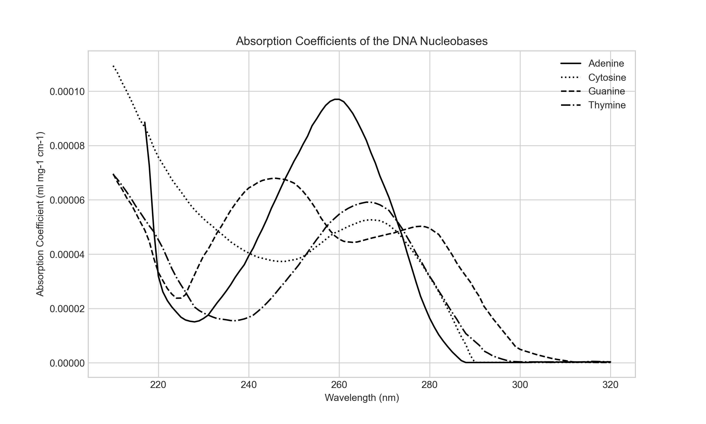

# DNA Absorption Analysis

## Background

As part of our ongoing research into the safety of far-UVC light, we're investigating the absorption profiles of various biological macromolecules. We've already examined protein absorption (see our [Protein Absorption Repository](https://github.com/lennijusten/protein-absorbance)), and are now turning our attention to DNA absorption. The absorption of ultraviolet (UV) light by DNA is important to understand because excessive exposure to UV radiation can cause damage to DNA, leading to potential health risks. 

While DNA as a whole molecule could be examined, we are focusing on the absorption of the individual nucleotides (adenine, cytosine, guanine, and thymine) that make up DNA. This is because the primary UV absorption in DNA between 200-300 nm occurs at the nucleotide bases as opposed to the sugar-phosphate backbone (Rodger 2013).

## Repository Structure

- `raw-data/`: Contains the raw CSV files extracted from Fig 2.8 in Kowalski (2009, 26) with units mL mol-1 cm-1.
- `processed-data/`: Contains the preprocessed CSV files with data converted to mL mg-1 cm-1 using the molar mass of each nucleotide and interpolated at 1 nm intervals.
- `preprocess.py`: Python script for sorting and interpolating the raw data.
- `analysis.py`: Python script for plotting the data.

## Methodology

Data for each nucleotide was extracted using WebPlotDigitizer from Fig 2.8 in Kowalski (2009, 26). The raw data was preprocessed using `preprocess.py`. 
The data was sorted in ascending order based on wavelength, converted to the correct units using the formula ε' = ε / M, where ε' is in mL mg-1 cm-1, ε is the original data in mL mol-1 cm-1, and Molecular Weight is in mg/mol. The absorbance was calculated at rounded 1 nm intervals between 210 and 320 nm using linear interpolation.

## Results

Figure 1: UV absorption spectra of the four primary nucleotides in DNA - adenine (A), cytosine (C), guanine (G), and thymine (T) - extracted from Kowalski (2009, 26).

  
## References
Rodger, A. UV Absorbance Spectroscopy of Biological Macromolecules. in Encyclopedia of Biophysics (ed. Roberts, G. C. K.) 2714–2718 (Springer, 2013).  
  
Kowalski, W. UVGI Disinfection Theory. in Ultraviolet Germicidal Irradiation Handbook: UVGI for Air and Surface Disinfection (ed. Kowalski, W.) 17–50 (Springer, 2009).
